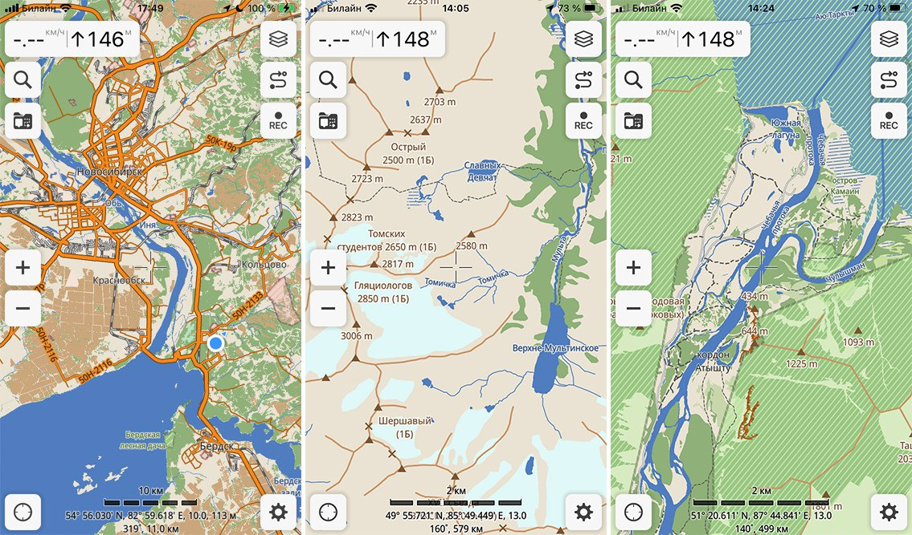

# Ingreelab alike map style for [Guru Maps](https://gurumaps.app)

Custom style for Guru Maps inspired by `Ingreelab.net` tiles render, to improve readability of maps.

[Русский](README_ru.md)

## Key features

* Increases amount of displayed objects on widescales depending on data availability and if it makes sense.
* Improves main roads/highways/railways visibility.
* Adds contrast display of forest tracks, footways etc. that is useful for hiking and offroad.

## How to install

To add this style into the app, download `Release (zip)` from the assets and save it to GuruMaps application folder.
- Android: `/Android/data/com.bodunov.galileo/` or `Android/data/com.bodunov.GalileoPro/files`
- iOS: `Files App` → `Guru Maps` or from computer `Locations`/`iTunes` → `Your device` → `Files` → `Guru Maps` or `Guru Maps Pro`
- macOS: `~/Library/Containers/com.bodunov.galileo/Data/Documents/`.

Then using file manager unzip it, restart `Guru Maps` and new style will be added into the offline maps list as `Ingreelab HD vX.Y.Z`.

### Small tip

In order for app data folder to appear, you need to create some point or record some track first. Some Android OS versions do not allow write
access to application folders. You may need to use desktop computer for this.

## Why it is called *Ingreelab HD*?

**Ingreelab** because it mimics rendering style of tiles from `Ingreelab.net`. **HD** because it is a high definition style and for sake of possible future releases of low definition styles. HD version was developed considering Siberian part of Russia with not so large amount of primary/secondary/tertiary roads. 

## Links

* Project link: https://github.com/zebooka/gurumaps-style-ingreelab

* iOS: https://apps.apple.com/us/app/guru-maps/id321745474
* Android: https://play.google.com/store/apps/details?id=com.bodunov.galileo

* Default style: https://github.com/GuruMaps/MapStyle
* MapCSS: https://gurumaps.app/manuals/ios/06-mapcss.html

## Authors

Based on [default style](https://github.com/GuruMaps/MapStyle) from Guru Maps team. No license specified in original style, 
though you may think this style is distributed under MIT license.

* Evgen Bodunov
* Anton Bondar https://zebooka.com
